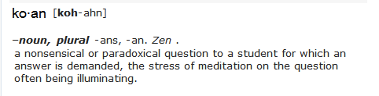

# Server koan specification

This repository is only about providing a Gherkin specification for a simple server koan. The application is essentially a server managing lists of TODO lists. The provided specification provides the settlement of the application's high-level behavior.

With the language of your choice, the repository is aimed at being used in the following way:

1. Fork it as or integrate it as a submodule to your learning project
2. Implement the failing step definitions corresponding to the specification
3. Implement the failing unit tests supporting the implementation of the specified features
4. Implement the features

